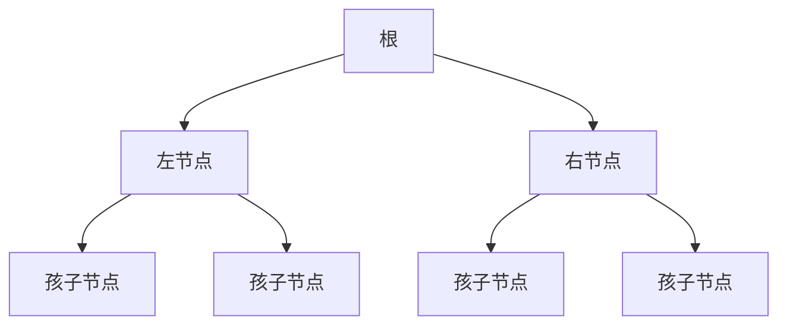

# DataStructure-gny
### 线性结构和非线性结构简介

#### 1.线性结构

- 线性结构作为最常用的数据结构，其特点是数据元素之间存在一对一的线性关系。
- 线性结构有两种不同的存储结构，即顺序存储结构和链式存储结构。顺序存储的线性表称为顺序表，顺序表中的存储元素是连续的。
- 链式存储的线性表称为链表，链表中的存储元素不一定是连续的，元素节点中存放数据元素以及相邻元素的地址信息。
- 线性结构常见的有：数组（==需要连续内存==）、队列、链表（==非连续内存==）、栈。

#### 2.非线性结构

非线性结构包括二维数组、多维数组、广义表、树结构、图结构

### 稀疏数组和队列

#### 1.稀疏数组

##### 1.1基本介绍

> 当一个数组中大部分元素为0，或者为同一个值时，可以使用稀疏数组来保存该数组。

- 稀疏数组的处理方法是：

  - 记录数组一共有几行几列，有多少个不同的值

  - 把具体的不同值的元素的行数和列数记录再一个小规模的数组中，从而缩小城乡的规模，使用小的二维数组来替代原本的二维数组。

  - 稀疏数组记录示例:

    | 行   | 列   | 值   |
    | ---- | ---- | ---- |
    | 1    | 1    | 2    |

- 案例，当编写五子棋的棋盘保存和恢复时，可以使用稀疏数组来压缩棋盘。

  

- 处理方法，第一行记录共几行几列以及不同值的个数。

- 代码实现：  

  ```java
  // 主函数
  public static void main(String[] args) {
          // 稀疏数组
          int [][] oldArray = new int[11][11];
          oldArray[1][2] = 1;
          oldArray[2][3] = 2;
          int row = oldArray.length;
          int len = oldArray[0].length;
          int dataNum = 0;
          for(int i = 0; i< oldArray.length; i++){
              for(int j = 0; j<oldArray[0].length; j++){
                  if(oldArray[i][j] != 0){
                      dataNum++;
                  }
              }
          }
          // 构建新数组
          int[][] newArray = new int[dataNum+1][3];
          newArray[0][0] = row;
          newArray[0][1] = len;
          newArray[0][2] = dataNum;
          conversion(oldArray,newArray);
          for(int i = 0; i < newArray.length; i++){
              System.out.println("第"+(i+1)+"行:" + newArray[i][0]+"--" + newArray[i][1]+"---" +newArray[i][2]);
          }
          // 将稀疏数组恢复为二维数组
          conversionArray(newArray);
  ```

  ```java
  // 稀疏数组转二维数组
      private static void conversionArray(int[][] newArray) {
          int[][] oldArray = new int[newArray[0][0]][newArray[0][1]];
          boolean temp = false;
          for(int[] arr:newArray){
              if(temp){
                  oldArray[arr[0]][arr[1]] = arr[2];
              }else{
                  temp = true;
              }
  
          }
          for(int i=0;i<oldArray.length;i++){
              for(int j=0; j<oldArray[0].length;j++){
                  System.out.print(oldArray[i][j]+"  ");
              }
              System.out.println("");
          }
      }
  ```

  ```java
  // 二维数组转稀疏数组
      private static void conversion(int[][] oldArray,int[][] newArray){
          int tempi = 1;
          for(int i=0;i<oldArray.length;i++){
              for(int j=0;j<oldArray[0].length;j++){
                  if(oldArray[i][j] != 0){
                      newArray[tempi][0] = i;
                      newArray[tempi][1] = j;
                      newArray[tempi][2] = oldArray[i][j];
                      tempi++;
                  }
              }
          }
      }
  ```

  ```java
  // 把稀疏数组存入文件
      public static void saveArray4Txt(int[][] newArray) throws IOException {
           FileWriter fileWriter = new FileWriter(FILEPATH,true);
          try{
              for(int[] array:newArray){
                  fileWriter.write((array[0]+"-"+array[1]+"-"+array[2])+"\r\n");
              }
          }catch (IOException e){
              e.printStackTrace();
          }finally {
              fileWriter.flush();
              fileWriter.close();
          }
      }
  ```

  ```java
  // 从文件转为 标准数组
      private static void conversionReader() throws FileNotFoundException {
          BufferedReader bufferedReader = new BufferedReader( new FileReader(FILEPATH));
         try {
             String[] newstr = bufferedReader.readLine().split("-");
             int[][] newarr = new int[Integer.parseInt(newstr[0])][Integer.parseInt(newstr[1])];
             String strtemp=null;
             while((strtemp = bufferedReader.readLine())!=null){
                 newstr = strtemp.split("-");
                 newarr[Integer.parseInt(newstr[0])][Integer.parseInt(newstr[1])] = Integer.parseInt(newstr[2]);
             }
         }catch (IOException e){
             e.printStackTrace();
         }finally {
             try {
                 bufferedReader.close();
             } catch (IOException e) {
                 e.printStackTrace();
             }
         }
      }
  ```

  #### 2.队列

  ##### 2.1队列介绍

  > - 队列是一个有序列表，可以用==数组==或是==链表==来实现。
  > - 遵循先入先出原则，有序，即：先存入队列的数据，要先取出，后存入队列的数据后取出

##### 2.2数组模拟队列

- 队列本身是有序列表，若使用数组的结构来存储队列的数据，则队列数组的的声明如下，需要一个maxSize来存储最大容量，由于队列的输入输出是在两端来操作的，所以需要两个变量==font==及==rear==来记录队列的首尾下标，font会随数据的输出而改变，rear会随数据的输入来改变。

- 代码实现：

  ```java
  package main.java.datastructure.queue;
  
  /**
   * 使用数组来模拟队列
   */
  public class ArrayQueue {
      private int maxSize;        // 队列的最大容量
      private int front;           // 队列头
      private int rear;           // 队列尾
      private int[] arr;          // 使用数组来模拟队列
  
      // 构造器
      public ArrayQueue(int cap){
          arr = new int[cap];
          maxSize = cap;
          rear = -1;          // 最后一个数据的下标
          front = -1;          // 第一个数据的前一个位置
      }
  
      // 判断队列是否满
      public boolean isFull(){
          return (rear == maxSize-1);
      }
  
      // 判断队列是否为null
      public boolean isEmpty(){
          return (rear == front);
      }
  
      // 添加数据到队列
      public void addQueue(int n){
          if(isFull()){
              System.out.print("队列已满");
              return;
          }
          arr[++rear] = n;
      }
  
      // 获取队列中数据
      public int get(){
          if(isEmpty()){
              throw new RuntimeException("队列为空");
          }
          front++;
          return arr[front];
      }
  
      // 展示队列所有数据
      public void showData(){
          if(isEmpty()){
              System.out.print("队列为空");
              return;
          }
          for(int i=front+1;i<=rear;i++){
              System.out.printf("arr[%d]=%d\n",i,arr[i]);
          }
      }
  
      // 展示头数据
      public int getHead(){
          if(isEmpty()){
              throw new RuntimeException("队列为空");
          }
          front++;
          return arr[front];
      }
  
      // 展示尾数据
      public int getLast(){
          if(isEmpty()){
              throw new RuntimeException("队列为空");
          }
          return arr[rear];
      }
  }
  
  ```

- 上面代码存在的问题，数组只能用一次，不可复用，解决方法，使用==环形队列==来优化原本的队列

  - 思路如下：
    - front指向第一个元素，rear执行最后一个元素的后一个位置，空出一个位置作约定。front和rear的初始值为0
    - 当队列满时的条件为 ==(rear+1)%maxSize=front==
    - 队列为空的条件 front = rear = 0
    - 队列中有效数据的个数:==(reat+maxSize-front)%maxSize==

### 3.链表

##### 3.1简介

> - 链表是以节点的方式存储
> - 每个节点包含data域，next域，next域执行下一节点
> - 链表不一定是顺序存储的，可以利用小的空间
> - 链表分为带头节点的链表和不带头节点的链表

1. ##### 带头节点的链表

   1. 头节点不存储具体数据。

   2. 用来标记链表的头。

      ```java
      // 节点
          private static class LinkNode<E>{
              private E data;
              private int sort;
              private LinkNode next;
      
              // 构造器
              public LinkNode(E e,int sort){
                  this.data = e;
                  this.sort = sort;
              }
              // 重写toString方法
      
              @Override
              public String toString() {
                  return "LinkNode{" +
                          "data=" + data +
                          '}';
              }
          }
      ```

      

##### 2.单链表按顺序添加 节点中保存一个数据用来记录sort

> 思路：寻找合适的添加位置 如果该sort在链表中的位置上已经有数据，跳出循环，提示不能添加
>
> 如果 当前节点的下一个节点 的sort值 大于 要添加节点的sort值
>
> 位置找到：要添加节点添加到当前节点的后面一个位置
>
> 如果链表循环完没有找到 节点值sort > 要添加数据的sort值，节点找到添加到最后

```java
// 添加节点带排序
    public void addAndSort(E e,int sort){
        LinkNode headTemp = head;
        LinkNode newNode = new LinkNode(e,sort);
        boolean result = true;
        while(headTemp.next!=null){
            if(headTemp.next.sort == sort){
                result = false;
                break;
            }
            else if(headTemp.next.sort > sort){
               break;
            }
            headTemp = headTemp.next;
        }
        if(!result){
            System.out.printf("添加失败，当前名称已有数据");
        }else{
            newNode.next = headTemp.next;
            headTemp.next = newNode;
        }

        return;
    }
```

##### 3.单链表修改数据

> 思路：根据sort去寻找匹配到修改，循环完匹配不到 提示信息

```java
// 修改节点
    public void modify(E e,int sort){
        LinkNode newNode = new LinkNode(e,sort);
        boolean flag = false;
        LinkNode temp = head;
        while(temp.next!=null){
            if(temp.next.sort == sort){
                temp.next.data = e;
                flag = true;
            }
            temp = temp.next;
        }
        if(false){
            System.out.printf("更新数据成功");
        }else {
            System.out.printf("未在链表中找到要更新的位置");
        }
    }
```

##### 4.单链表删除节点

> 通过遍历链表找到要删除的节点(根据排序寻找) ,找到后使用一个临时变量 赋值为 要删除的节点
>
> 当前节点的next = 要删除节点的next 要删除节点 = null

```java
// 删除节点
    public void delete(int sort){
        LinkNode temp = head;
        boolean falg = false;
        while(temp.next!=null){
            if(temp.next.sort == sort){
                falg = true;
                break;
            }
            temp = temp.next;
        }
        if(!falg){
            System.out.printf("删除节点失败，没有此节点");
        }else{
            LinkNode next = temp.next;
            temp.next = next.next;
            next = null;
        }
    }
```

##### 5.单链表的反转

> 思路:通过一次遍历去反转单链表，如何反转？
>
> 第一步：找到当前要反转的节点，如第一次要反转的节点head.next（head为头节点，并存值）
>
> 第二步：使用temp来执行当前要反转的节点.
>
> 第三步：headTemp = head(初始化)   headTemp.next = temp.next;
>
> ​		temp.next = headTemp;
>
> ​		head = temp;
>
> 第四步，循环中改变位置：
>
> temp = headTemp.next;

```java
class Solution {
    public ListNode reverseList(ListNode head) {
        if(head==null) return head;
        ListNode headTemp = head;
        ListNode temp = head.next;
        while(temp!=null){
            headTemp.next = temp.next;
            temp.next = head;
            head = temp;
            temp = headTemp.next;
        }
        return head;
    }
}
```


##### 6.单链表反向打印

> - 先反转链表再打印
> - 先遍历链表存入栈中，再从栈中取出打印，可以使用linkedList代替Stack因为Stack继承了Vector（线成安全）

```java
// 反向打印链表
    public void last4Show(){
        LinkNode headTemp = head;
        Stack<LinkNode> stack = new Stack<>();
        while(headTemp.next!=null){
            stack.push(headTemp.next);
            headTemp = headTemp.next;
        }
        while(!stack.empty()){
            System.out.printf(stack.pop().data.toString());
        }
        stack = null;
    }
```

##### 6.合并有序链表

```java
 public ListNode mergeTwoLists(ListNode l1, ListNode l2) {
        if(l1==null){
            return l2;
        }
        if(l2==null){
            return l1;
        }
        ListNode head = null;
        ListNode temp = null;
        if(l1.val>l2.val){
            head = l2;
            temp = l1;
        }else{
            head = l1;
            temp = l2;
        }
        ListNode cur1 = head;
        ListNode cur2 = null;
        while(temp!=null){
            if(cur1.next == null){
                cur1.next = temp;
                break;
            }
            if(temp.val>=cur1.val && temp.val<cur1.next.val){
                    cur2 = temp;
                    temp = temp.next;
                    cur2.next = cur1.next;
                    cur1.next = cur2;
            }
            cur1 = cur1.next;
        }
        return head;
        
    }
```

##### 7.双向链表

1. ###### 与单向链表的比较

   - 单向链表，查找的方向只能是一个方向，而双向链表可以向前或者向后查找。
   - 单向链表不能自我删除，而需要依靠辅助节点，而双向链表可以自我删除，所以前面我们单链表删除节点时，总是找到temp的下一个节点来删除的。

2. ###### 节点构成(静态内部类)

   - pre和next和data,可以向前查找，亦可以向后查找
   - pre指向前一个节点
   - next指向后一个节点
   - data存储数据

3. ###### 静态内部类和非静态内部类的区别

   - 非静态内部类会持有外部类的引用，持有改引用可导致外部类回收不了。
     - 编译器自动为内部类添加一个成员变量， 这个成员变量的类型和外部类的类型相同， 这个成员变量就是指向外部类对象(this)的引用；<br>
     - 编译器自动为内部类的构造方法添加一个参数， 参数的类型是外部类的类型， 在构造方法内部使用这个参数为内部类中添加的成员变量赋值；<br>
     - 调用内部类的构造函数初始化内部类对象时，会默认传入外部类的引用。
     - 总结：==非静态内部类不能含有静态属性及方法，因为非静态内部类依赖与外部类的创建==。
   - 静态内部类默认不持有外部类引用，当在里面引用外部类时，可已使用==虚引用==来防止影响外部类被回收。

4. ###### 代码实现

   ```java
   // 初始化即节点
   package main.java.datastructure.queue;
   
   import sun.awt.image.ImageWatched;
   
   public class DoubleLinkedListDemo<E> {
       private LinkNode<E> head;
       private LinkNode<E> last;
       private int size;
       public DoubleLinkedListDemo(){
       }
       private static class LinkNode<E> {
           E data;
           int sort;
           LinkNode pre;
           LinkNode next;
           public LinkNode(E e){
               this.data = e;
           }
           public LinkNode(E e,int sort){
               this.data = e;
               this.sort = sort;
           }
           @Override
           public String toString() {
               return "LinkNode{" +
                       "data=" + data.toString() + ",sort=" + sort+
                       '}';
           }
       }
   }
   
   ```

   ```java
   // 按照顺序添加  注意head==null的情况和保证尾节点的正确性
       public void addAndSort(E e, int sort){
           boolean flag = true;
           LinkNode<E> node = new LinkNode<>(e,sort);
           LinkNode headTemp = head;
           if(head == null){   // 头节点为null
               head = node;
               last = node;
               flag = false;
           }else {
               while(headTemp != null){
                   if(headTemp.sort == sort){
                       System.out.printf("添加失败，排序已存在");
                       flag = false;
                       break;
                   }
                   // 添加到目标节点前
                   if(headTemp.sort > sort){
                       break;
                   }
                   headTemp = headTemp.next;
               }
           }
           // 执行添加
           if(flag){
               if(headTemp == null){
                   last.next = node;
                   node.pre = last;
                   last = node;
               }
                else if(headTemp.pre == null){  // 头节点
                   node.next = headTemp;
                   headTemp.pre = node;
                   head = node;
               }else{ // 非头节点
                   node.next = headTemp;
                   node.pre = headTemp.pre;
                   headTemp.pre.next = node;
                   headTemp.pre = node;
               }
           }
       }
   ```

   ```java
   // 修改
       public void modfiy(E e,int sort){
           LinkNode headTemp = head;
           while(headTemp != null){
               if(headTemp.sort == sort){
                   headTemp.data = e;
                   break;
               }
               headTemp = headTemp.next;
           }
       }
   ```

   ```java
   // 按照排序删除
       public void del(int sort){
           LinkNode headTemp = head;
           boolean flag = false;
           while(headTemp != null){
               if(headTemp.sort == sort){
                   flag = true;
                   break;
               }
               headTemp = headTemp.next;
           }
           if(flag){ // 删除
               if(headTemp.next == null){   // 删除最后一个节点的情况，维护尾节点
                   last = last.pre;
               }
               if(headTemp.pre == null){    // 删除头节点的情况 
                   head = headTemp.next;
                   if(head != null){
                       head.pre = null;
                   }
               }else {
                   headTemp.pre.next = headTemp.next;
                   if(headTemp.next != null){
                       headTemp.next.pre = headTemp.pre;
                   }
               }
                headTemp = null;
           }
       }
   
   
   ```

##### 9.单项环形链表

1. ###### 应用场景

   约瑟夫问题：编号为1，2，3...n的n个人围坐一圈，每次数m个，那个人出列，再重新数。

2. ###### 环形链表代码实现

   需要一个头指针first和一个尾指针last，尾指针的next指向头指针

   ```java
   package main.java.datastructure.queue.约瑟夫;
   
   import sun.awt.image.ImageWatched;
   
   import java.util.ArrayList;
   import java.util.List;
   
   /**
    * 环形链表
    * @param <E>
    */
   public class QueueH<E> {
       private LinkNode<E> first;   // 第一个节点
       private LinkNode<E> curNode; // 最后一个节点
       private List<E> list = new ArrayList<>();        // 保存出链表顺序
       public QueueH(){
   
       }
   
       public List<E> getList() {
           return list;
       }
       // 添加节点
       public void add(E e){
           LinkNode node = new LinkNode(e);
           if(first==null){        // 链表为null
               first = node;
               curNode = node;
           }else{                  // 链表不为null
               curNode.next = node;
               curNode = node;
           }
           // 形成环
           curNode.next = first;
       }
       // 遍历环形链表
       public void show(){
           LinkNode temp = first;
           while(temp.next != first){
               System.out.printf(temp.data.toString());
               temp = temp.next;
           }
           System.out.printf(curNode.data.toString());
       }
   
   	// 节点
       private static class LinkNode<E>{
           E data;
           LinkNode next;
           public LinkNode(E e){
               this.data = e;
           }
   
           @Override
           public String toString() {
               return "LinkNode{" +
                       "data=" + data +
                       '}';
           }
       }
   }
   
   
   ```

   约瑟夫问题解决代码

   ```java
   // 根据输入产生出队列
       public void popAll(int temp){
           LinkNode<E> cur = curNode;
           LinkNode<E> headT = first;
           while(headT.next != headT){
               for(int i=0;i<temp-1;i++){
                   headT = headT.next;
                   cur = cur.next;
               }
               list.add(headT.data);
               cur.next = headT.next;
               headT = headT.next;
           }
           list.add(headT.data);
       }
   
   ```

### 4.栈

1. ##### 简介

   > - **栈的英文为Stack**
   > - **栈是一个==先入后出==的有序列表。**
   > - **栈是限制线性表中元素的插入和删除==只能在线性表的同端==进行的一种特殊线性表。允许插入和删除的一端，为==栈顶==，另一端为==栈底==。**
   > - **根据栈的定义可知，最先放入栈中的元素在栈底，最后放入的元素在栈顶，而删除刚好相反，最后放入的元素最先出栈。**

##### 2.应用场景

1. 子程序调用：在跳往子程序前，会先将下个指令的地址存到栈中，知道子程序执行后再将地址取出，以回到原来的程序中。
2. 处理递归调用：和子程序的调用类型，只是除了存储下一个指令的地址外，也将参数、区域变量等数据存入栈中。
3. 表达式的转换（中缀表达式转为后缀表达式）与求值。
4. 二叉树的遍历。
5. 图形的深度优先搜索（dpath-first）。

##### 3.数组模拟栈的实现

- 需要一个变量来指向栈顶，初始化为-1

- 入栈，指向栈顶的变量+1

- 出栈，指向栈顶的变量-1

- ###### 代码实现（数组版）

  ```java
  package main.java.datastructure.mystack;
  
  public class ArrayStackDemo<E> {
      private Object[] data;       // 数组
      private int maxSize;    // 最大容量
      private int top;        // 表示栈顶，初始化为-1
  
      public ArrayStackDemo(int cap){
          top = -1;
          data = new Object[cap];
          this.maxSize = cap;
      }
  
      // 判断栈满
      public boolean isFull(){
          return top == maxSize-1;
      }
      // 栈空
      public boolean isEmpty(){
          return top == -1;
      }
      // 入栈
      public void push(E e){
          if(isFull()){
              System.out.printf("栈已满");
              return;
          }
          top++;
          data[top] = e;
      }
      // 出栈
      public E pop(){
          // 判断栈是否为null
          if(isEmpty())
              throw new RuntimeException("栈为空");
          E res = (E) data[top];
          top--;
          return res;
      }
      // 遍历栈
      public void show(){
          // 判断栈是否为空
          if(isEmpty())
              throw new RuntimeException("栈空");
          int topTemp = top;
          for(int i=topTemp;i>=0;i--){
              System.out.println(data[i].toString()+"\t");
          }
      }
  }
  
  
  ```

- ###### 代码实现（链表版）

  ```java
  package main.java.datastructure.mystack;
  
  /**
   * 链表实现栈
   * @param <E>
   */
  public class LinkedStackDemo<E> {
      private LinkNode<E> top;        // 指向栈顶
  
      // 栈是否为空
      public boolean isEmpty(){
          return top == null;
      }
      // 添加数据
      public void push(E e){
          LinkNode node = new LinkNode(e);
          if(top!=null){
              node.next = top;
          }
          top = node;
      }
      // 获取数据
      public E pop(){
          if(isEmpty())
              throw new RuntimeException("栈为空");
          E res = top.data;
          LinkNode node = top;
          top = top.next;
          node = null;
          return res;
      }
      // 遍历栈
      public void show(){
          LinkNode temp = top;
          while(temp!=null){
              System.out.println(temp.data.toString());
              temp = temp.next;
          }
      }
      // 节点
      private static class LinkNode<E>{
          E data;
          LinkNode next;
  
          public LinkNode(E e){
              this.data = e;
          }
      }
  
  }
  
  
  ```

4. ##### 简单表达式计算，只含+-*/

   > 思路：两个栈，数栈和符号栈
   >
   > 如果是符号
   >
   > ​	符号栈为空，入栈
   >
   > ​	符号栈不为空，当前符号优先级大于栈中符号优先级，入栈
   >
   > ​	符号栈不为空，当前符号优先级小于等于栈中符号优先级，计算值，并值，符号入栈
   >
   > 最后如果符号栈不为空，计算

   ```java
   package main.java.datastructure.mystack;
   
   import java.util.Scanner;
   
   /**
    * 表达式计算
    */
   public class StackMath {
       public static void main(String[] args) {
           int a=0;
           int b=0;
           Character fh = null;
           int num = 0;
           String curNum = "";         // 处理多位数
           Scanner scanner = new Scanner(System.in);
           System.out.println("请输入要计算的表达式");
           String s = scanner.nextLine();
           char[] chars = s.toCharArray();
           // 两个栈，数栈和符号栈
           LinkedStackDemo<Integer> stackNum = new LinkedStackDemo<>();
           LinkedStackDemo<Character> stackFH = new LinkedStackDemo<>();
           for (int i=0;i<chars.length;i++) {
               if (Character.isDigit(chars[i])) {// 数字
                   curNum+=chars[i];
                   if(i!=chars.length-1 && Character.isDigit(chars[i+1])){
                       continue;
                   }
                   stackNum.push(Integer.parseInt(curNum));
                   curNum = "";
               } else {                      // 符号
                   if (stackFH.isEmpty()) {  // 符号栈为空直接放入
                       stackFH.push(chars[i]);
                   } else if (priority(chars[i], stackFH)) { //c 的优先级大于 c1的优先级
                       stackFH.push(chars[i]);
                   }else if(!priority(chars[i],stackFH)){     // c的优先级小于等于 c1的优先级
                       count(stackNum,stackFH);  // 计算值并存入数栈
                       // 此时需要循环判断栈中下一个符号与当前符号的优先级关系，满足接着计算如：5-2*3+1 当计算完2*3后接着计算5-6
                       while (!stackFH.isEmpty()&&!priority(chars[i],stackFH)){
                           count(stackNum,stackFH);
                       }
                       stackFH.push(chars[i]);                // 存入符号
                   }
               }
           }
           // 如果符号栈不为空，计算
           while (!stackFH.isEmpty()){
               count(stackNum,stackFH);
           }
           System.out.println("结果为:"+stackNum.pop());
       }
       // 计算数并存入数栈
       private static void count(LinkedStackDemo<Integer> stackNum,LinkedStackDemo<Character> stackFH) {
           int a = stackNum.pop();
           int b = stackNum.pop();
           Character fh = stackFH.pop();
           int num = count(b,a,fh);
           stackNum.push(num);
       }
   
       // 计算
       private static int count(int a, int b, Character fh) {
           int result = 0;
           switch (fh){
               case '+':
                   result = a + b;
                   break;
               case '-':
                   result = a - b;
                   break;
               case '*':
                   result = a * b;
                   break;
               case '/':
                   result = a / b;
                   break;
                   default:
                       break;
           }
           return result;
       }
   
       // 判断两个符号的优先级  c的大于栈中第一个符号优先级 返回 true
       private static boolean priority(char c, LinkedStackDemo<Character> stackFH) {
           boolean result = false;
           char c1 = stackFH.pop();
           stackFH.push(c1);
           if((c=='*' || c=='/') && (c1=='+'||c1=='-'))
               result = true;
           return result;
       }
   }
   
   
   
   
   ```

5. ##### 前缀表达式（波兰表达式）

   > **前缀表达式的操作符号位于表达式之前**
   >
   > **（3+4）*5-6的前缀表达式为    - * + 3 4 5 6**

6. 前缀表达式计算介绍

   **会从右至左扫描，当遇到数值时把数值传入栈，当遇到符号时，会从栈中取出两个数计算(a操作符b)，并把计算结构入栈，依次计算。**

##### 6.后缀表达式（逆波兰表达式）

> 后缀表达式的操作符号位于表达式的后面
>
> (3+4)*5-6的后缀表达式为3 4 + 5 * 6  -

1. 后缀表达式计算介绍

   **从左到右扫描，需要数字时把数字入栈，遇到运算符时，出栈两个数据，并计算（b操作符a)，计算结果入栈，依次计算。**

##### 7.中缀表达式转后缀表达式

1. ###### 示例

   中缀表达式 1+ ( ( 2 + 3 ) * 4) - 5 转后缀

   - 转化步骤
     - **初始化两栈符号栈(stack1)，数栈(stack2)**
     - **从左到右的扫描表达式**
     - **遇到操作数时，入栈stack2**
     - **遇到运算符时**
       - **如果stack1为空，运算符入栈**
       - **否则，当前运算符优先级 大于 stack1栈顶 运算符优先级或stack1栈顶运算符为"("时，运算符入栈**
       - **否则，当前运算符优先级 小于等于 stack1 栈顶原算法优先级时，stack1栈顶运算符出栈入stack2栈，知否重复遇到运算符时的操作**
     - **遇到括号时**
       - **左括号，直接入stack1栈**
       - **有括号，stack1出栈知道遇到左括号，出栈的运算符入stack2栈，消除左右括号**
     - **重复步骤 扫描表达式，直到扫描完**
     - **将stack1栈中剩余的操作符出栈并入栈stack2**
     - **最后stack2出栈的逆序为后缀表达式**

2. ###### 代码实现

   ```java
   package main.java.datastructure.mystack;
   
   import main.java.datastructure.queue.SignLinkedListDemo;
   
   import java.util.Scanner;
   
   /**
    * 逆波兰表达式计算
    */
   public class NPolandCout {
       private static  boolean loop = true;
       public static void main(String[] args) {
           Scanner scanner = new Scanner(System.in);
           String infixStr = null;
           String nPolandStr = null;
           String[] nPolandArray = null;
   
           while(loop){
               System.out.println("请输入中缀表达式(exit退出):");
               infixStr = scanner.nextLine();
               if("exit".equals(infixStr)){
                   loop = false;
                   break;
               }
               nPolandStr = infix2nPoland(infixStr);
               nPolandArray = nPolandStr.split(" ");
               countNPoland(nPolandStr);
   
           }
       }
   
       /**
        * 中缀表达式转后缀表达式
        * @param infixStr
        * @return nPolandStr
        */
       private static String infix2nPoland(String infixStr) {
           String[] infixStrArray = infixStr.split(" ");
           LinkedStackDemo<String> symbolStack = new LinkedStackDemo<>(); // 符号栈
           SignLinkedListDemo<String> nPolandStack = new SignLinkedListDemo<>(); // 后缀表达式栈
           String symbolTop = null;                                        // 符号栈顶的符号
           for(int i = 0; i < infixStrArray.length; i++){// 遍历中缀表达式
               if(infixStrArray[i].matches("\\d+")){ // 数字入数栈
                   nPolandStack.add(infixStrArray[i]);
               }else {                                    // 符号后错误输入
                   if(infixStrArray[i].length() > 1)
                       throw new RuntimeException("操作符输入有误");
                   symbolStackIsNotEmpty(infixStrArray[i],symbolStack,nPolandStack);
               }
           }
           while(!symbolStack.isEmpty()){
               symbolTop = symbolStack.pop();
               nPolandStack.add(symbolTop);
           }
           // 返回nPolandStack中的数据
           StringBuilder builder = new StringBuilder();
           while(!nPolandStack.isEmpty()){
               builder.append(nPolandStack.get());
           }
           return builder.toString();
       }
   
       /**
        * 处理S为符号且符号栈不为空
        * @param s
        * @param symbolStack
        * @param nPolandStack
        */
       private static void symbolStackIsNotEmpty(String s, LinkedStackDemo<String> symbolStack, SignLinkedListDemo<String> nPolandStack) {
           String symbolTop = null;                // 栈顶符号
           if(symbolStack.isEmpty() || "(".equals(s)){              // 符号栈为空
               symbolStack.push(s);
           }else{                                  // 符号栈不为空
               symbolTop = symbolStack.pop();
               symbolStack.push(symbolTop);
               if("(".equals(symbolTop)){ // 栈顶为小括号
                   symbolStack.push(s);
               }else if(")".equals(s)){   // 当前操作符为右括号
                   symbolTop = symbolStack.pop();
                   while(!"(".equals(symbolTop)){
                       nPolandStack.add(symbolTop);
                       symbolTop = symbolStack.pop();
                   }
               }
               else{                      // 栈顶为运算符
                   if(isPriority(s,symbolTop)){     // 当前符号优先级大于栈顶符号优先级
                       symbolStack.push(s);
                   }else{  // 当前符号优先级小于 等于 栈顶符号优先级
                       symbolTop = symbolStack.pop();
                       nPolandStack.add(symbolTop);
                       // 从符号栈是否为空判断处执行
                       symbolStackIsNotEmpty(s,symbolStack,nPolandStack);
                   }
               }
           }
       }
   
       /**
        * 判断s的优先级是否大于symbolTop的优先级
        * @param s
        * @param symbolTop
        * @return 大于 1 小于等于 0
        */
       private static boolean isPriority(String s, String symbolTop) {
           boolean result = false;
           if(("*".equals(s) || "/".equals(s)) && ("+".equals(symbolTop) || "-".equals(symbolTop)))
               result = true;
           return false;
       }
   
       // 逆波兰表达式的计算
       private static void countNPoland(String nPolandStr) {
           final char[] nPolandArray = nPolandStr.toCharArray();
           LinkedStackDemo<String> stack = new LinkedStackDemo<>();    // 用来存储表达式
           for(char s:nPolandArray){
               if("exit".equals(s)){
                   loop = false;
               }
               else{
                   if(isNum(s+"")){                       // 如果是数字入栈
                       stack.push(s+"");
                   }else{                              // 符号 计算结果并入栈
                       cout(stack,s+"");
                   }
               }
           }
           if(!"exit".equals(nPolandStr)){
   
           }
               System.out.println("结果为:"+stack.pop());
       }
   
       private static void cout(LinkedStackDemo<String> stack, String s) {
           int result = 0;
           int a=Integer.valueOf(stack.pop());
           int b=Integer.valueOf(stack.pop());
           switch (s){
               case "+":
                   result = a + b;
                   break;
               case "-":
                   result = b - a;
                   break;
               case "*":
                  result = a * b;
                  break;
               case "/":
                   result = b / a;
                   break;
                   default:
                       break;
           }
           stack.push(result+"");
       }
   
       // 是否为数字
       private static boolean isNum(String s) {
           char[] chars = s.toCharArray();
           boolean result = true;
           if(!s.matches("\\d+")){
               result = false;
               if(s.length()>1)
                   throw new RuntimeException("输入有误");
           }
           return result;
       }
   }
   
   
   ```

   

### 5.递归

1. ###### 应用场景

   迷宫问题（回溯）、递归

2. ###### 递归调用机制

   基于jvm运行时数据区的栈，栈中存储局部变量，方法返回地址。方法自己调用自己，然后在jvm栈中再创建一个方法，局部变量可以改变。

3. ###### 递归需要遵守的规则

   1. 执行一个方法时，就创建一个新的受保护的独立空间（栈空间）
   2. 方法的局部变量是独立的，不会互相影响，比如n变量
   3. 如果方法中使用的是引用变量（比如数组），就会共享该引用类型的数据
   4. 递归必须向退出递归的条件逼近，否则就是无限递归，出现StackOverflowError
   5. 当一个方法执行完毕，或是遇到return，就会返回，遵守谁调用，就将结果返回给谁，同时当方法执行完毕或者返回时，该方法也就执行完毕。

4. ###### 递归能够解决的问题

   1. 8皇后问题，汉诺塔，迷宫问题，球和篮子的问题。
   2. 快排，归并排序，二分查找，分治算法
   3. 使用栈解决的问题

##### 9.使用递归来解决迷宫问题

1. ###### 问题描述

   > **有一个迷宫地图，使用二维数组map表示map的四周为1表示墙，中间也有墙**
   >
   > **1 表示墙 0 表示为走过的路**

2. ###### 解决思路

   > **首先需要考虑如何走的问题，指定一个规则，下  --> 右  ->上  --> 左**
   >
   > **其次考虑做过的标记，初始为0表示没走，2表示走通 3 表示走不通**
   >
   > **之后考虑如何递归：当map`[`endX`]``[`endY`]` == 2时返回true**  

3. 代码实现

   ```java
   package main.java.datastructure.recursion;
   
   /**
    * 使用递归来解决迷宫问题
    */
   public class MiGong {
       public static void main(String[] args) {
           // 使用数组模拟一个迷宫
           int[][] map = new int[8][7];
           // 使用 1 表示墙  上下全部设为1
           initMap(8,7,map);
           map[3][1] = 1;
           map[3][2] = 1;
           // 使用递归回溯来找到一条出去的路径
   
           boolean result = setway(map,1,1,6,5);
           if(result){
               for(int i=0;i<8;i++){
                   for(int j=0;j<7;j++){
                       System.out.printf(map[i][j]+"\t");
                   }
                   System.out.printf("\n");
               }
           }else {
               System.out.println("走不通!");
           }
   
       }
   
       /**
        *使用递归回溯来找路  节点为0时，该节点未走过  1 时表示墙  2 表示为通路 3 该位置走过但无法到达终点
        * @param map  地图
        * @param startX 开始x坐标
        * @param startY 开始y坐标
        * @param endX      结束x坐标
        * @param endY      结束y坐标
        *  走的规则（自己定义） 先下，再右，再上，再左 如果走不通则回溯
        */
       private static boolean setway(int[][] map, int startX, int startY, int endX, int endY) {
           if(map[endX][endY] == 2){ // 通路找到
               return true;
           }else{                      // 没有走到终点
               if(map[startX][startY] == 0){   // 当前节点
                   // 走路策略 下 -》 右 -》 上 -》 左
                   map[startX][startY] = 2;     // 先假设能走通，当前节点设为2
                   if(setway(map,(startX+1),startY,endX,endY)){
                       return true;
                   }else if(setway(map,startX,startY+1,endX,endY)){
                       return true;
                   }else if(setway(map,startX-1,startY,endX,endY)){
                       return true;
                   }else if(setway(map,startX,startY-1,endX,endY)){
                       return true;
                   }else{ // 走不通  当前节点设为 3
                       map[startX][startY] = 3;
                       return false;
                   }
               }else { // map[startX][startY] = 1 || 2 || 3
                   return false;
               }
           }
       }
   
       /**
        * 初始化迷宫，四周都为1
        * @param row
        * @param col
        * @param map
        */
       private static void initMap(int row, int col, int[][] map) {
           int [] temp = map[0];
           int [] temp1 = map[row-1];
           for(int i=0;i<col;i++){
               temp[i] = 1;
               temp1[i] = 1;
           }
           for(int i=1;i<row-1;i++){
               map[i][0] = 1;
               map[i][col-1] = 1;
           }
       }
   
   }
   
   
   ```

   

##### 10.使用递归来解决8皇后问题

1. ###### 问题描述

   > 一个8*8的棋盘，每行需要摆一个皇后，相邻行的皇后不能处于同一行，也不能处于同一列，不然会相互攻击，求出所有摆法。

2. 解决思路

   > 1. **第一个皇后先放在第一行的第一列**
   > 2. **第二个皇后放在第二行的第一列，然后判断是否符合规则（所有皇后不能在同一行也不能再同一列），如果不符合，让在第二行的第二列，依次把所有列试一下，找到一个合适的位置**
   > 3. **继续放第三个皇后，还是从第一列开始放，知道找到一个正确的位置。**
   > 4. **当得到一个正确解时，在栈回退到上一个栈时，就开始回溯，即将第一个皇后放在第一行的所有列的所有解。**
   > 5. **然后回头继续第一个皇后放第二列，后面接着循环前四步。**
   > 6. **理论上需要创建一个二维数组来表示棋盘，但使用一个一维数组也可以表示，第一个元素表示第一个皇后所在的列数。**

##### 3.代码实现

```java
package main.java.datastructure.recursion;

/**
 * 使用递归来解决8皇后问题
 */
public class EgintQueen {
    static int result = 0;
    static int max = 8;
    static int[] map = new int[8];  //棋盘 0~7表示7个行 每个中的值表示放在所在行的列
    public static void main(String[] args) {
        // 分析 递归需要的参数 row 当前行
        doEgintQueen(0);
        System.out.printf("共%d中解法\n",result);
    }

    /**
     * 思路
     * 1. 第一行放在第一列
     * 2. 第二行放在第二列，判断是否符合规则，找到一个合适的位置
     * 3. 依次放第三行依次到最后，找到一个合适的位置
     * 4. 找到路径后回溯，即第一行放第二次，找出所有解
     * @param row 当前行
     */
    private static void doEgintQueen(int row) {
        if(row == max){
            result++;
            print();
            return;
        }
        for(int i=0;i<max;i++){
            map[row] = i;
            if(isRule(row)){        // 找到正确的位置
                doEgintQueen(row+1);
            }
        }
    }

    /**
     * 判断当前行放的位置是否符合规则
     * @param row 当前行家
     * @return true 符合 false 不符合  一条直线上 x坐标差 == y坐标差
     */
    private static boolean isRule( int row) {
        boolean result = true;
        int diff = 0;
        for(int i=0;i<row;i++){
            diff = Math.abs(map[i] - map[row]);
            if(0 == diff || Math.abs(row-i) == Math.abs(map[row] - map[i])){
                result = false;
                break;
            }
        }
        return result;
    }

    /**
     * 打印正确的路线
     */
    private static void print(){
        for(int i=0;i<max;i++){
            System.out.printf(map[i]+"\t");
        }
        System.out.printf("\n 一种解法");
    }
}


```

### 6.排序算法

##### 1.排序算法介绍

> 排序也称排序算法（Sort Algorithm），排序是将一组数据，依指定的顺序进行排列的过程。

###### 2.排序的分类：

1. 内部排序：

   指将要处理的所有数据都加载到内部存储器中进行排序。

   2. 外部排序：

   数据量过大，无法全部加载到内存中，需要借助外部存储进行排序。

###### 3.常见的排序算法分类

- 排序
  - 内部排序：使用内存
    - 插入排序
      - 直接插入排序
      - 希尔排序
    - 选择排序
      - 简单选择排序
      - 堆排序
    - 交换排序
      - 冒泡排序
      - 快速排序
    - 归并排序
    - 基数排序
  - 外部排序：使用内存与外存结合

##### 2.冒泡排序

1. ###### 基本介绍

   > 冒泡排序（Bubble Sorting）的基本思想是：通过对待排序序列从前向后（从下标较小的元素开始），依次比较相邻元素的值，若发现逆序则交换，使值较大的元素逐渐从前向后移，。n*n

2. ###### 优化

   > 在排序的过程中，个元素不断接近自己的位置，如果一趟比较下来没有进行交换，就说明有序。

3. ###### 排序规则

   > 一共进行n-1次排序
   >
   > 每一趟排序长度依次减少，比较相邻元素
   >
   > 如果在某次排序中没有发生交换，可排序结束
   >
   > 时间复杂度n*n

4. ###### 代码实现

   ```java
   /**
        * 冒泡排序
        * @param arr
        */
       private static void doBubbleSort(int[] arr) {
           boolean flag = true;	// 是否可提前结束
           for(int i=0;i<arr.length-1;i++){
               for(int j=1;j<arr.length-i;j++){
                   if(arr[j]<arr[j-1]){
                       swap(arr,j-1,j);		// 简化i和j的值
                       flag = false;
                   }
               }
               if(flag)
                   break;
               else
                   flag = true;		// 重置flag
           }
       }
   
   ```

   

   ##### 3.选择排序

   1. ###### 思路：

      > 从0~n-1中找最小的与第一个元素交换，依次交换
      >
      > 速度要比冒泡快，因为冒泡需要频繁交换相邻元素 n*n

   2. ###### 代码实现:

      ```java
      /**
        * 选择排序
        * @param arr
        */
          private static void doSelectSort(int[] arr) {
              int min = 0;
              for(int i=0;i<arr.length-1;i++){
                  for(int j=i;j<arr.length;j++){
                      if(arr[min]>arr[j])
                          min = j;
                  }
                  if(min != i)
                  swap(arr,min,i);
              }
              System.out.println("排序结果:"+ Arrays.toString(arr));
          }
      
      ```

##### 4.插入排序

1. ###### 思路:

   > 插入排序(Insertion Sorting) 的基本思想是：把n个待排序的元素看成为一个有序表和一个无序表，有序表开始只含有一个元素，无序表中有n-1个元素，排序过程中每次从无序表中取出第一个元素，插入到有序表中的合适位置，依次排序。n*N

2. ###### 代码实现

   ```java
   // 插入排序
       private static void doInserationSort(int[] arr) {
           int j=0; int cur = 0;
           for(int i=1;i<arr.length;i++){
               // 插入排序
               j = i;
               cur = arr[i];
               while(j>0 && cur<arr[j-1]){
                   arr[j] = arr[j-1];  // 后移
                   j--;
               }
               arr[j] = cur;	// 插入到正确的位置
           }
       }
   
   ```

   

##### 5.希尔排序

1. ###### 介绍

   > 希尔排序是希尔于1959年提出的一种排序算法。希尔排序也是一种==插入排序==，它是简单插入排序经过改进之后的一个更高效版本，也称为==缩小增量排序==，简单排序当最小的在最后时，移动比较多，而希尔排序会尽量使小数尽快跳到前面.n*logn

2. ###### 希尔排序基本思想

   > 希尔排序是把记录按下标的一定增量分组，对每组使用直接插入排序算法排序；随着增量的逐渐减少，每组包含的关键词越来越多，当增量减至1时，整个文件恰好被分成一组，排序结束。

3. ###### 代码实现

   ```java
   // 进行希尔排序，分组排序，并逐渐减少分组，最后只剩一个分组就是简单插入排序
       private static void doShellSort(int[] arr) {
           int temp = (arr.length+1) / 2;
           int j = 0;
           int cur = 0;
           while(temp>0){
              for(int i=0+temp;i<arr.length;i++){
                  j = i;
                  cur = arr[i];
                  while(j-temp>=0 && cur < arr[j-temp]){
                      arr[j] = arr[j-temp];
                      j = j -temp;
                  }
                  if(j!=i)
                      arr[j] = cur;
              }
              System.out.println("希尔排序:"+Arrays.toString(arr));
              temp = temp / 2;
           }
           System.out.println("排序完成:"+ Arrays.toString(arr));
       }
   
   ```

   

##### 6.快速排序

1. ###### 介绍

   > 快速排序(QuickSort)是对冒泡排序的一种改进。基本思想是：通过一趟排序将要排序的数据分割成独立的两部分，其中一部分的所有数据都比另外一部分的所有数据都要小，然后再按此方法对这两部分分别进行快速排序，整个排序过程可以递归进行，以此达到整个数据变成有序序列。n*logn


2. 代码实现

   ```java
   // 快排
       private static void doQuickSort(int[] arr, int lo, int hi) {
           if(lo>=hi)		// 注意递归结束条件
               return;
           int l = lo;
           int h = hi+1;
           int cur = arr[l];
           while(true){
               while(arr[++l] < cur){
                   if(l == hi){
                       break;
                   }
               }
               while(arr[--h]>cur){
                   if(h == lo){
                       break;
                   }
               }
               if(l>=h)			// 注意跳出循环条件
                   break;
               swap(arr,l,h);
           }
           swap(arr,lo,h);
           doQuickSort(arr,lo,h-1);			// 排左边
           doQuickSort(arr,h+1,hi);			// 排右边
       }
   
   ```

3. 优化，当数组小时可以使用插入排序来优化，如当数组hi = lo +12时使用插入排序

4. 3切分的快排，相等的在中间 lt 小于的指针 gt大于的指针 i进行循环

   ```
   // 三路快排
   private static void doThreeQuick(int[] arr, int lo, int hi) {
       if(lo >= hi){			// 注意循环结束条件
           return;
       }
       int lt = lo;
       int gt = hi;
       int i = lo+1;
       int cur = arr[lo];
       int compare = 0;
       while(i<=gt){
           if(arr[i] > cur){
               compare = 1;
           }else if(arr[i] < cur){
               compare = -1;
           }
           if(compare == 1){		// 当前大于cur和gt交换gt--
               swap(arr,i,gt);
               gt--;
           }
           else if(compare == -1){	// 当前小于cur和lt交换 lt++ i++
               swap(arr,i,lt);
               i++;
               lt++;
           }else{
               i++;
           }
       }
       doThreeQuick(arr,lo,lt-1);		// 左边
       doThreeQuick(arr,gt+1,hi);		// 右边
   }
   
   ```

##### 7.归并排序

1. 介绍

   > 归并排序（merge-sort）是利用归并的思想实现的排序方法，该算法采用经典的分治（divide-and-conquer）策略（分治法将问题分（divide）成一些小的问题然后递归求解，而治（conquer）的阶段则将分的阶段得到的各答案“修补”在一起，即分而治之。n*logN

2. 代码实现

   ```java
   package main.java.datastructure.sort;
   
   import java.util.Arrays;
   
   public class MergeSort {
       static int[] arr1 = new int[8];		// 辅助数组
       public static void main(String[] args) {
           int[] arr = {8,4,5,7,1,3,6,2};
           preMergeSort(arr,0,arr.length-1);
           System.out.println(Arrays.toString(arr1));
       }
       // 归并排序准备
       private static void preMergeSort(int[] arr , int lo , int hi) {
           int mid = 0;
           // 先分解 ，再合并
           if(lo+1 != hi){
               mid = lo + (hi - lo +1) /2;
               preMergeSort(arr,lo,mid-1);
               preMergeSort(arr,mid,hi);
           }
           // 合并
           merge(arr,lo,hi);
       }
       // 合并
       private static void merge(int[] arr, int lo, int hi) {
           System.out.printf("开始合并lo=%d,hi=%d\n",lo,hi);
           int mid = 0;
           int i= lo;
           int j = 0;
           int temp = lo;
           if(lo+1 == hi){
               if(arr[lo] > arr[hi]){
                   arr1[lo] = arr[hi];
                   arr1[hi] = arr[lo];
               }else{
                   arr1[lo] = arr[lo];
                   arr1[hi] = arr[hi];
               }
           }else{
               mid = lo + (hi-lo+1)/2;
               j = mid;
               while(i<mid && j<=hi){
                   if(arr[i] < arr[j]){
                       arr1[temp++] = arr[i];
                       i++;
                   }else{
                       arr1[temp++] = arr[j];
                       j++;
                   }
               }
               if(i==mid){
                   for(int x = j;x<=hi;x++){
                       arr1[temp++] = arr[x];
                   }
               }
               else if(j == hi+1){
                   for(int x = i;x<mid;x++){
                       arr1[temp++] = arr[x];
                   }
               }
           }
           for(int x=lo;x<=hi;x++){	// 把辅助数组的改变写回到原数组
               arr[x] = arr1[x];
           }
       }
   
   
   }
   
   
   ```

   

##### 8.基数排序

1. ###### 介绍

   > - 基数排序（radix sort)属于“分配式排序”（distribution sort），又称“桶子法”，顾名思义，它是通过键值的各个位的值，将要排序的元素分配至某些“桶”中，达到排序的作用。
   > - 基数排序法是属于稳定性的排序，基数排序法是效率高的稳定性排序法，但对空间的占有非常高。
   > - 基数排序（redix Sort）是桶排序的扩展
   > - 基数排序是1887年赫尔曼·何乐礼发明的，它的实现是：循环此为为数组中的最大数字的长度，然后按照 个、十、百等尾数来把数字放入对应的桶中，需要十个桶，并需要一个数组来保存每个桶中保存的数据量。n*k

2. 代码实现

   ```java
   // 进行基数排序
       private static void doRadixSort(int[] arr) {
           // 需要十个数组  使用二维数组表示
           int[][] radixArr = new int[10][arr.length];
           // 需要一个数组记录各个数组中存的数
           int[] numArr = new int[10];
           // 获取这组数据中最长的位数来确定排序的次数
           int maxLen = getMaxLen(arr);
           int temp = 1;  // 用来依次取尾数
           int endNum = 0; //尾数
           int index = 0;
           // 开始循环
           for(int i=0;i<maxLen;i++){
               index = 0;
               // 第i次处理
               for(int j = 0 ; j < arr.length ; j++){
                   endNum = (arr[j]/temp) % 10;        // 取尾数
                   radixArr[endNum][numArr[endNum]++] = arr[j];    // 放到尾数对应的那个数组中
               }
               // 从十个数组中取数据依次放入原数组中
               for(int k = 0 ; k < 10 ; k++){
                   for(int h = 0 ; h < numArr[k] ; h++){
                       arr[index++] = radixArr[k][h];
                   }
                   numArr[k] = 0;      // 取完数据后 记录十个数组中存储数据的数组设为0
               }
               // temp*10 取下一位
               temp = temp * 10;
           }
           System.out.println("排序结果:" + Arrays.toString(arr));
   
       }
   
   ```

3. ###### 基数排序说明

   - 基数排序是对传统桶排序的扩展，速度很快。

   - 基数排序是经典的空间换时间的方式，占用内存很大，当对海量数据排序时，容易造成OutOfMemoryError。

   - 基数排序是稳定的。

   - > 稳定的含义，是比如原本在数组中a和b的值相同，并且a在b前面，那么排序后a仍然在b的前面

   - 有负数时需要修改代码进行基数排序，可以使用20个桶来排/x*k

### 7.查找算法

#### 1.介绍

> 在java中，常用的查找有四种：
>
> - 顺序（线性）查找
> - 二分查找/拆半查找
> - 插值查找
> - 斐波那契查找

#### 2.顺序查找

> 遍历一个集合或数组查找即可。

#### 3.二分查找

1. ##### 介绍

   > 需对==有序==数组进行二分查找
   >
   > 每次比较中间的数所以效率比较高为2^n^

2. ##### 代码实现

   ```java
   // 二分查找
       private static int doBinarySearsh(int[] arr, int lo, int hi , int target) {
           int mid = 0;
           int compare = 0;
           int res = -1;
           while(lo <= hi){
               mid = lo + (hi-lo)/2;
               if(arr[mid] > target){
                   compare = 1;
               }else if(arr[mid] < target){
                   compare = -1;
               }else {
                   res = mid;
                   break;
               }
               // 处理 变量！
               if(compare == 1){
                   hi = mid;
               }else {
                   lo = mid +1;
               }
           }
           return res;
       }
   
   ```

   

   

#### 3.插值查找

1. ##### 介绍

   > 插值查找公式: mid = lo + (hi -lo )* (target - arr[lo]) / (arr[hi] - arr[lo])
   >
   > mid为自适应，当数据量比较大时，并且数据分布比较均匀时，查找数据比二分查找要快，使用概率来自适应。

2. ##### 适应场景

   > 对于数据量较大，关键字分布比较均匀的查找表来说，采用插值查找比二分查找更快。
   >
   > 关键字分布不均匀的情况下，该方法不一定比拆半查找更好。

3. ##### 代码实现:

   ```java
   // 插值查找
       private static int doInsertSearsh(int[] arr, int target) {
           int lo = 0;
           int hi = arr.length-1;
           int mid = 0;
           int compare = 0;
           int result =-1;
           while(lo <= hi){
               if(target < arr[lo] || target > arr[hi]){ // 防止越界情况
                   break;
               }
               mid = lo + (hi-lo) * (target - arr[lo]) / (arr[hi] - arr[lo]);
               if(arr[mid] > target){
                   compare = 1;
                   hi = mid -1;
               }else if(arr[mid] < target){
                   compare = -1;
                   lo = mid +1;
               }else {
                   result = mid;
                   break;
               }
   
               System.out.println("=========");
           }
           return result;
       }
   
   ```

   

#### 4.斐波那契（黄金分割法）查找算法

1. ##### 介绍

   > - 黄金分割点是指把一条线段分割为两部分，使其中一部分与全长之比等于另一部分与这部分之比，取其前三位数字的近似值是0.618。由于按照次比例设计的造型十分美丽，因此称为黄金分割，也成为中外比。
   > - 斐波那契数列(1,1,2,3,5,8,13,21,34,55)发现斐波那契数列的两个相邻数的比例无限接近黄金分割值0.618

2. ##### 斐波那契(黄金分割法)查找算法

   > 斐波那契查找原理与前两种相似，仅仅改变了中间节点(mid)的位置，mid不再是中间或插值得到，而是位于黄金分割点附近，即mid = low + F(k-1) -1(F代表斐波那契数列)

3. ##### 对F(k-1)-1的理解

   - 由斐波那契数列F(k) = F(k-1) + F(k-2)的性质，可以得到F(k)-1 = F(k-1)-1 + F(k-2)-1 +1，由次式可知，只要顺序表的长度为F[k] -1,则可以将该表分为F(k-1)-1 和 F(k-2) -1 两部分。
   - low F(k-1)-1 mid F(k-2)-1

4. ##### 代码实现

   ```java
   // 斐波那契查找
       private static int doFibonacciSearsh(int[] arr , int target) {
           int [] fiboArr = getFiboArr();      // 斐波那契数列
           int lo = 0;
           int hi = arr.length-1;
           int k = 0;                          // fiboArr[k] 为适应的数组长度
           int result = -1;
           while(hi > fiboArr[k]){
               k++;
           }
           int[] temp = Arrays.copyOf(arr,fiboArr[k]);  // 临时数组，后面补0，0换成arr[hi]
           for(int i=hi;i<temp.length;i++){
               temp[i] = arr[hi];
           }
           int mid = 0;
           while(lo <= hi){
               mid = lo + fiboArr[k-1] -1; // 分为 f[k-1] 和f[k-2] 两部分，mid为lo + f[k-1] -1
               if(target < temp[mid]){
                   hi = mid -1;
                   k--;        // f[k] = f[k-1] + f[k-2] 前面k-1 后面 k-2
               }else if(target > temp[mid]){
                   lo = mid +1;
                   k = k - 2;
               }else {
                   result = mid > hi ? hi:mid;
                   break;
               }
           }
           return result;
       }
   
   ```

   

### 8.哈希表

1. #### 基本介绍

   > 散列表(Hash Table，也叫哈希表)，是根据关键码值(Key Value) 而直接进行访问的数据结构。也就是说，它通过把关键码值映射到表中一个位置来访问记录，以加快查找的速度。这个映射函数叫做散列函数，存放记录的数组叫做散列表。

2. ##### 应用场景

   - 缓存

3. ##### 代码实现

   ```java
   package main.java.datastructure.hashtab;
   
   /**
    * 哈希表的简单实现
    */
   public class HashTabDemo<E> {
   
       private LinkedData<E>[] linkedDataArr;
       int size;
       public HashTabDemo(int size){
           linkedDataArr = new LinkedData[size];
           this.size = size;
           // 需要初始化每一个数组元素，否则数组元素为null会报空指针异常
           for(int i=0 ; i<size ; i++){
               linkedDataArr[i] = new LinkedData<>();
           }
       }
       // 添加数据
       public void add(int id,E e){
           int cur = hash(id);         // 获取要插入的数组下标
           linkedDataArr[cur].add(id,e);
       }
       // 遍历数据
       public void list(){
           for(int i=0 ; i < size ;i++){
               if(null != linkedDataArr[i])
                linkedDataArr[i].list();
           }
       }
       // 根据id 查找数据
       public E get(int id){
           int cur = hash(id);
           E e = linkedDataArr[cur].find(id);
           if( null == e){
               System.out.println("没找到");
           }
           return e;
       }
   
       private int hash(int id) {
           return id % size;
       }
   
       // 链表
       private static class LinkedData<E>{
           int id;
           E e;
           LinkedData next;
           LinkedData head;
           public LinkedData(){
   
           }
           public LinkedData(int id , E e){
               this.e = e;
               this.id = id;
           }
           // 添加数据
           public void add(int id , E e){
               LinkedData data = new LinkedData(id,e);
               LinkedData temp = head;
               if(head == null){
                   head = data;
               }else { // 添加到链尾
                   while(temp.next != null){
                       temp = temp.next;
                   }
                   temp.next = data;
               }
           }
           // 遍历链表
           public void list(){
               LinkedData temp = head;
               if(temp != null){
                   while(temp!=null){
                       System.out.println("data:" + temp.e.toString());
                       temp = temp.next;
                   }
               }else {
                   System.out.println("链表为空");
               }
           }
   
           public E find(int id) {
               E result = null;
               LinkedData<E> temp = head;
               if(null != temp){
                   while(temp != null){
                       if(temp.id == id){
                           result = temp.e;
                           break;
                       }
                   }
               }
               return result;
           }
       }
   }
   
   
   ```

   

### 9.树形结构

1. 为什么需要树这种数据结构

   > - 数组存储方式分析
   >   - 优点：通过下标方式访问元素，速度快。对于有序数组，还可使用二分查找/插值查找/斐波那契查找来提高检索效率。
   >   - 缺点：如果要检索具体的某个值，或者插入（按一定顺序）会整体移动，而且插入需要考虑扩容的问题，效率低下。
   > - 链式存储方式分析
   >   - 优点：在一定程度上对数组存储方式有优化（比如：插入一个数值节点，只需要将插入节点链接到链表中即可，删除效率也高）。
   >   - 缺点：在进行检索时，效率仍然较低，比如（检索某个值，需要从头节点开始遍历）
   > - 树存储方式分析
   >   - 能提高数据存储、读取的效率，比如利用二叉排序树（BinarySotrTree），既可以保证数据的检索速度，同时也可以保证数据的插入、删除、修改的数度。

#### 1.二叉树

1. ##### 树示意图



2. ##### 数的常用术语解释

   - 节点
   - 根节点
   - 父节点
   - 子节点
   - 叶子节点(没有子节点的节点)
   - 节点的权(节点值)
   - 路径(从root节点找到该节点的路线)
   - 层
   - 子树
   - 树的最大高度(最大层数)
   - 森林(多颗子树构成森林)

3. ##### 二叉树的概念

   1. 每个节点==最多只能有两个子节点==的一种形式称为二叉树，含有一个子节点也是二叉树。

   2. 二叉树的子节点分为左节点和右节点。

      ```mermaid
      graph TD
      A[Root] --> B[Left]	
      A[Root] --> C[Right]
      ```

   3. 如果该二叉树的==所有叶子节点都在最后一层==，并且节点总数=2^n^-1,n为层数，则为满二叉树

   4. 如果该二叉树的==所有叶子节点都在最后一层或者倒数第二层，并且最后一层的叶子节点在左边连续，倒数第二层的叶子节点在右边连续==我们称为完全二叉树。

4. ##### 二叉树的遍历

   1. 前序遍历：先父节点，再左节点，再右节点
   2. 中序遍历：先左节点，再父节点，再右节点
   3. 后序遍历：先左节点，再右节点，再父节点
   4. 看输出父节点的顺序。

5. ##### 二叉树的代码实现 及 三种遍历实现

   ```java
   package main.java.datastructure.tree;
   
   import sun.reflect.generics.tree.Tree;
   
   /**
    * 二叉树实现
    */
   public class BinaryTreeDemo<E> {
       TreeNode<E> root;
       public BinaryTreeDemo(E e){
           root = new TreeNode<>(e);
       }
   
       public TreeNode<E> getRoot() {
           return root;
       }
   
       public void addLeft(TreeNode parent, E e){
           TreeNode<E> temp = new TreeNode<>(e);
           parent.left = temp;
       }
   
       public void addRight(TreeNode parent,E e){
           TreeNode<E> temp = new TreeNode<>(e);
           parent.right = temp;
       }
   
       /**
        * 先输出父节点，再左，再右
        * @param temp 前序遍历
        */
       public void preList(TreeNode temp){
           if(temp == null)
               return;
           System.out.println(temp.data.toString());
           preList(temp.left);
           preList(temp.right);
       }
   
       /**
        * 先左，再父，再右
        * @param temp 中序遍历
        */
       public void infixList(TreeNode temp){
           if(temp == null)
               return;
           infixList(temp.left);
           System.out.println(temp.data.toString());
           infixList(temp.right);
       }
   
       // 后序遍历
       public void endList(TreeNode temp){
           if(temp == null)
               return;
           endList(temp.left);
           endList(temp.right);
           System.out.println(temp.data.toString());
       }
   
   
       public static class TreeNode<E>{
           E data;
           TreeNode<E> left;
           TreeNode<E> right;
   
           public TreeNode(){
   
           }
           public TreeNode(E e){
               this.data = e;
           }
   
           public TreeNode<E> getLeft() {
               return left;
           }
   
           public void setLeft(TreeNode<E> left) {
               this.left = left;
           }
   
           public TreeNode<E> getRight() {
               return right;
           }
   
           public void setRight(TreeNode<E> right) {
               this.right = right;
           }
   
           @Override
           public String toString() {
               return "TreeNode{" +
                       "data=" + data +
                       '}';
           }
       }
   }
   
   
   ```

6. ##### 二叉树的前、中、后序查找方法实现

   ```java
    // 先序查找
       public E preFind(TreeNode<E> parent,E e){
           E result = null;
           if(parent == null)
               return null;
           if(compare(e,parent.data)){   // 查找根
               return parent.data;
           }
            if((result = preFind(parent.left,e)) == null){ // 向左查找
                return preFind(parent.right,e);        // 向右查找
            }else {
                return result;  // 左查找找到返回
            }
       }
   
       // 中序查找
       public E infixFind(TreeNode<E> parent,E e){
           E result = null;
           if(parent == null)
               return null;
           if((result = infixFind(parent.left,e))==null){  // 向左查找
               if(compare(e,parent.data)) // 比较当前
                   return parent.data;
           }else {
               return result;
           }
           return infixFind(parent.right,e);    // 向右查找
       }
   
       // 后序查找
       public E endFind(TreeNode<E> parent,E e){
           E result = null;
           if(parent == null)
               return null;
           if((result = endFind(parent.left,e)) == null){  // 向左查找
               if((result = endFind(parent.right,e))==null){ // 向右查找
                   if(compare(e,parent.data))  // 查找根
                       return parent.data;
               }else {
                   return result;
               }
           }else {
               return result;
           }
           return result;
       }
   
   ```

7. ##### 两个对象的比较

   ```java
   /**
        * 比较两个对象
        * @param e obj1
        * @param data obj2
        * @return 是否相等
        */
       private boolean compare(E e, E data) {
           if(e == data)
               return true;
           if(e==null || e.getClass()!=data.getClass())
               return false;
           Emp obj1 = null;
           Emp obj2 = null;
           if(e.getClass() == Emp.class){
               obj1 = (Emp) e;
           }
           if(data.getClass() == Emp.class){
               obj2 = (Emp) data;
           }
           if(obj1 == null || obj2 == null)
               return false;
           if(obj1.getId() != obj2.getId())
               return false;
           return obj1.getName().equals(obj2.getName());
   
       }
   
   ```

8. ##### 删除节点，如果为叶子节点，删除，如果为非叶子节点，删除子树

   1. ###### 思路

      > - 因为我们的二叉树是单向的，所以我们是判断==当前节点的子节点==是否要删除，而不可直接判断当前节点。
      > - 如果当前节点的右子节点不为空，并且左子节点 是要删除的节点，就将this.left = null;并且返回，结束递归
      > - 如果当前节点右子节点不为空，并且右子节点是要删除的节点，删除，返回。
      > - 如果上两步都没有找到要删除的节点，那么返回，进行上层递归
      > - 还有一种情况，只有一个根节点，置空整个树

   2. ###### 代码实现

      ```java
      // 递归删除节点 true找到并删除 false没找到要删除的节点
         public boolean delNode(TreeNode<E> parent,E e){
              if(parent == root){
                  if(compare(e,parent.data)){
                      root = null;
                  }
              }
              if( null == parent ){
                  return false;
              }
              boolean result = false;
              if(compare(e,parent.left.data)){         // 比较当前节点
                  doDel(parent);
                  parent.left = null;					// 内部属性赋值为null
                  return true;
              }else if(compare(e,parent.right.data)){
                  doDel(parent.right);
                  parent.right = null;				// 内部属性赋值为null
                  return true;
              }
      
              if(null != parent.left){            // 向左递归
                  result = delNode(parent.left,e);
              }
              if(!result && null != parent.right){
                  result = delNode(parent.right,e);
              }
              return result;
          }
          // 删除节点
          private void doDel(TreeNode<E> node) {
              if(node == null)
                  return;
              TreeNode<E> left = null;
              TreeNode<E> right = null;
              if(node.left!=null){
                  left = node.left.left;
                  right = node.left.right;
                  node.left = null;					// 内部属性赋值为null
                  doDel(left);
                  doDel(right);
              }else if(node.right != null){
                  left = node.right.left;
                  right = node.right.right;
                  node.right = null;					// 内部属性赋值为null
                  doDel(left);
                  doDel(right);
              }
          }
      
      ```

   ###### 3.思考

   > 删除节点时，不可直接node=null而应该node.left=null 或 node.right=null
   >
   > 是由于递归时我们没有return node,node=null是没有意义的。
   >
   > 但我们可以把一个对象的内部属性赋值为null

9. ##### 顺序存储二叉树

1. ###### 介绍

   > 从数据存储来看，==数组存储方式和树的存储方式==可以互相转换，即数组可以转换成树，树也可以转换成数组，示意图如下。

   

2. ###### 要求

   > - 上图的二叉树节点，要求以数组的方式来存放arr:[0,1,2,3,4,5,6]
   > - 要求再遍历数组arr时，仍然可以以==前序遍历，中序遍历，后序遍历==的方式完成节点的遍历。

3. 顺序存储二叉树的特点：

   > - 顺序二叉树通常只考虑完全二叉树
   > - 第n个元素的左子节点为 2*n+1
   > - 第n个元素的右子节点为2*n+2
   > - 第n个元素的父节点为:(n-1)/2
   > - n：表示二叉树中的第几个元素（按0开始编号）

4. 代码实现

   ```java
   private static void prelist(int[] arr, int cur) {
           if(arr == null || cur >= arr.length)
               return;
           System.out.println(arr[cur]);
           prelist(arr,2*cur+1);
           prelist(arr,2*cur+2);
       }
   
   ```

   

5. ##### 二叉树线索化

   1. ###### 介绍

      > left指向子树后前驱，right指向子树或后继
      >
      > 需要一个成员变量来记录 pre

   2. 代码实现

      ```java
       // 线索化二叉树  left指向左子节点或前驱节点  right指向右节点或后序节点  前序遍历实现 leftType 0 子树 1 前驱
          public void threadedBinaryTree(TreeNode<E> node){
              if(node == null){
                  return;
              }
              // 先线索化当前节点
              if(node.left == null){
                  node.left = pre;
                  node.leftType = 1;
              }
              if(pre != null && pre.right==null){
                  pre.right = node;
                  pre.rightType = 1;
              }
              pre = node;
              // 线索化左节点
              if(node.leftType != 1)
                  threadedBinaryTree(node.left);
              // 线索化右节点
              if(node.rightType != 1)
              threadedBinaryTree(node.right);
          }
      
      ```

      

##### 11.二叉树线索化遍历

```java
// 线索化二叉树遍历 前序
    public void thrededlist(TreeNode<E> node){
        while (node != null){
            System.out.println(node.data);
            while(node.rightType != 1){
                System.out.println(node.left.data);
                node = node.left;
            }
            while(node.rightType == 1){
                node = node.right;
                System.out.println(node.data);
            }
            if(node.leftType == 1 && node.right ==null){
                break;
            }else {
                node = node.left;
            }

        }
    }

```

#### 2.堆排序

1. ##### 介绍

   > 堆排序是利用堆这种数据结构而设计的一种排序算法，堆排序是一种==选择排序==，它的最坏，最好，平均时间复杂度均为O(nlog^n^)，它也是不稳定排序。
   >
   > 堆是具有以下行在的完全二叉树，每个节点的值都大于或等于其左右孩子节点的值，称为大顶堆，==注意：没有要求节点的左孩子的值和有孩子的值的大小关系==。
   >
   > 每个节点的值都小于后等于其左右孩子节点的值，称为小顶堆
   >
   > ==使用大顶堆进行升序排序，小顶堆进行降序排序。==

2. ##### 大顶堆图示

   

3. ##### 排序步骤

   > - 将待排序序列构造成一个大顶堆
   > - 此时，整个序列的最大值就是堆顶的根节点。
   > - 将其与末尾元素进行交换，此时末尾就是最大值。
   > - 然后将剩余n-1个元素重新构造一个堆，反复前几步执行。

4. ##### 代码实现

   ```java
   public static void main(String[] args) {
           int[] arr = {14,25,10,65,24,75,26,85,36};
           int temp = 0;
           for(int i=(arr.length-1)/2;i>=0;i--){// 从最后一个非叶子节点，到根节点，构造一个最大堆[构造阶段]
               doSort(arr,i,arr.length);
           }
           System.out.println(Arrays.toString(arr));
           for(int i=arr.length-1;i>0;i--){  // 取堆顶元素与末尾交换再维护一个最大堆[排序阶段]
               temp = arr[i];
               arr[i] = arr[0];
               arr[0] = temp;
               doSort(arr,0,i);
           }
           System.out.println(Arrays.toString(arr));
       }
   
   // 下沉
       public static void doSort(int[] arr , int i , int len){
           // 从i开始调整
           int k = 0 ;
           int temp = arr[i];
           for(;(k=i*2+1)<len;){
               if(k+1<len&& arr[k] < arr[k+1]){
                   k++;
               }
               if(arr[k] > temp){
                   arr[i] = arr[k];
                   i = k;
               }else {
                   break;
               }
           }
           arr[i] = temp;
       }
   
   ```

   

#### 3.赫夫曼树

1. ##### 基本介绍

   > - 给定n个权值作为n个==叶子节点==，构造一棵二叉树，若该树的==带权路径长度（wpl）==达到最小，称这样的二叉树为==最优二叉树==，也称为==赫夫曼树(HuffmanTree)==。
   > - 赫夫曼树是带权路径长度最短的树，权值越大的节点离根越近。

2. ##### 赫夫曼树几个重要概念和举例说明

   - 路径和路径长度：在一棵树中，从一个节点往下可以达到的孩子或孙子节点之间的通路，称为路径。通路中分支的数目称为路径长度。若规定根节点的层数为1，则从根节点到第L层的路径长度为L-1。
   - ==节点的权及带权路径长度==：若将树中节点赋给一个带有着某种含义的数值，则这个数值称为该节点的权。==节点的带权路径长度为==：从根节点到该节点之间的路径长度与该节点的权的乘积。


- 树的带权路径长度：树的带权路径长度规定为所有==叶子节点==的带权路径长度之和，记为WPL(Weighted path length)，权值越大的结点离根节点越近的二叉树才是最优二叉树。
- WPL最小的就是赫夫曼树

3. ##### 构造赫夫曼树

   - 思路:

     - 从小到大进行排序，将每一个数据，构造成一个节点，每个节点可以看成一颗最简单的二叉树。
     - 取出根节点权值最小的两颗二叉树
     - 组成一颗新的二叉树，该二叉树的根节点的权值是两个二叉树的权值之和。
     - 再将这颗新的二叉树，以根节点的权值大小进行排序，不断重复前面的步骤，直到只存在一颗二叉树的情况。

   - 代码实现

     ```java
     package main.java.datastructure.tree;
     
     import sun.reflect.generics.tree.Tree;
     
     import java.util.ArrayList;
     import java.util.Arrays;
     import java.util.Collections;
     import java.util.List;
     
     /**
      * 赫夫曼树构建
      */
     public class HuffmanTree {
         public static void main(String[] args) {
             int[] arr = {13,7,8,3,29,6,1};
             doQuickSort(arr,0,arr.length-1);
             //doHeapSort(arr);
             System.out.println(Arrays.toString(arr));
             // 遍历arr构造ArrayList
             List<TreeNode> list = new ArrayList<TreeNode>();
             for(int i=0;i<arr.length;i++){
                 list.add(new TreeNode(arr[i]));
             }
             System.out.println(list);
             TreeNode left = null;
             TreeNode right = null;
             TreeNode temp = null;
             // 构造赫夫曼树
             /**
              * 1.取两个最小的值组成一个子树
              * 2.接着取值来构建一个更大的子树
              */
             while(list.size()>1){
                 left = list.get(0);
                 right = list.get(1);
                 temp = new TreeNode(left.data + right.data);
                 temp.left = left;
                 temp.right = right;
                 list.remove(left);
                 list.remove(right);
                 list.add(temp);
                 Collections.sort(list);
             }
             TreeNode root = list.get(0);
             TreeNode.preList(root);
         }
     
         // 构造赫夫曼树
     
     
         private static class TreeNode implements Comparable<TreeNode> {
             int data;
             TreeNode left;
             TreeNode right;
     
             public TreeNode(int val){
                 this.data = val;
             }
     
             @Override
             public int compareTo(TreeNode other) {
                 return this.data - other.data;
             }
             // 前序遍历
             public static void preList(TreeNode root){
                 if(root == null)
                     return;
                 System.out.println(root.data);
                 preList(root.left);
                 preList(root.right);
             }
         }
     
         // 堆排序
         public static void doHeapSort(int[] arr){
             // 构造最大堆
             for(int i = (arr.length-1)/2;i>=0;i--){
                 doSink(arr,i,arr.length);
             }
             //堆排序
             for(int i=arr.length-1;i > 0; i--){
                 swap(arr,0,i);
                 doSink(arr,0,i);
             }
         }
     
         // 下沉  构造最大堆
         private static void doSink(int[] arr, int i,int len) {
             int temp = arr[i];
             int k = 0;
             while( (2*i+1) < len ){
                 k = 2*i+1;
                 if(k+1<len && arr[k+1] > arr[k])
                     k++;
                 if(arr[k] > temp){
                     arr[i] = arr[k];
                     i = k;
                 }else
                     break;
             }
             arr[i] = temp;
         }
     
         //快速排序
         public static void doQuickSort(int[] arr,int lo , int hi){
             if(lo >= hi)
                 return;
             int cur = arr[lo];
             int h = hi+1;
             int l = lo;
             while (true){
                 while(arr[++l] < cur){
                     if(l == hi){
                         break;
                     }
                 }
                 while(arr[--h] > cur){
                     if(h == lo){
                         break;
                     }
                 }
                 if(h <= l)
                     break;
                 swap(arr,h,l);
             }
             swap(arr,lo,h);
             doQuickSort(arr,lo,h-1);
             doQuickSort(arr,h+1,hi);
         }
     
         private static void swap(int[] arr, int h, int l) {
             int temp = arr[h];
             arr[h] = arr[l];
             arr[l] = temp;
         }
     }
     
     
     
     ```

     
